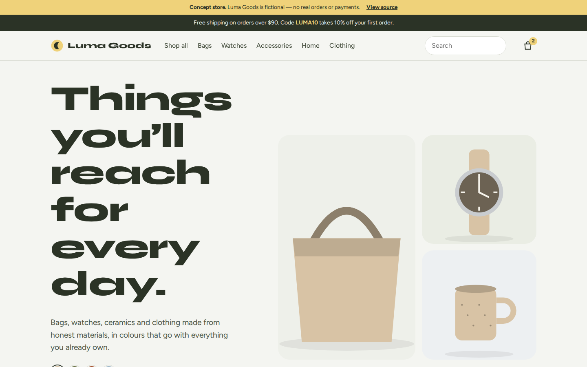
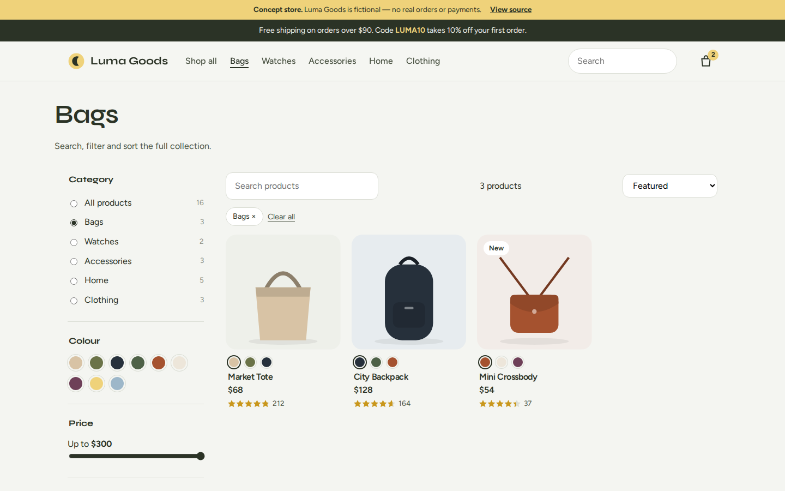
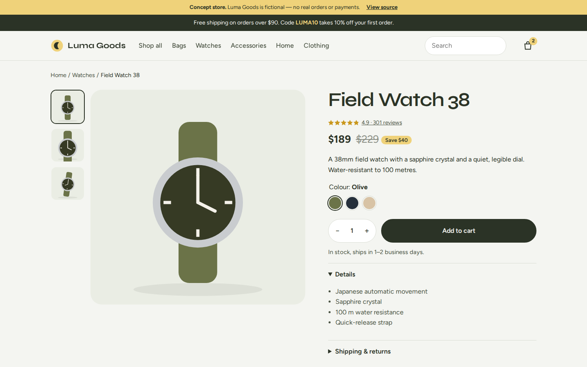
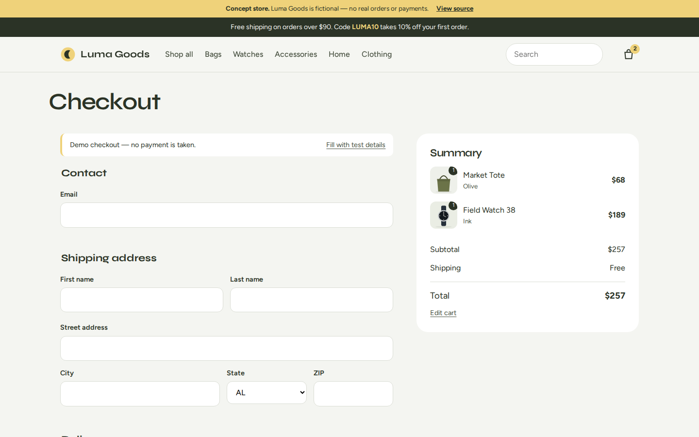
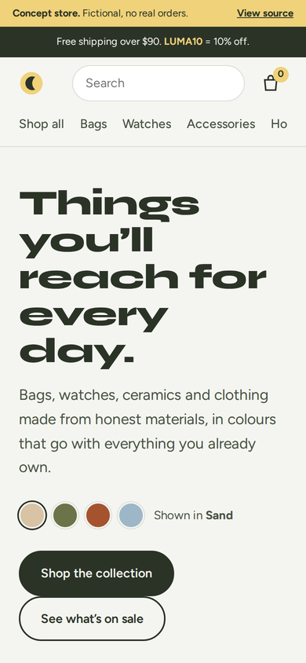
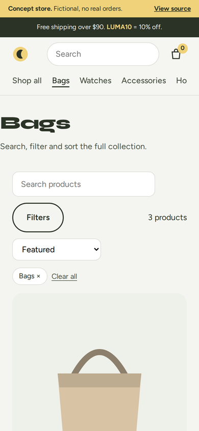

# Luma Goods — E-commerce store

> **Concept project.** Luma Goods is a fictional business created for a web design portfolio. All names, people, reviews, figures and prices are samples. No real orders, payments or messages are processed.

**[View the live demo →](https://mustufashaikh.github.io/luma-goods/)**

A complete online store for a fictional lifestyle brand selling bags, watches, accessories, home goods and clothing. It runs entirely in the browser, with no backend.

## Features

- **Shop**: live search, category, colour and price filters, stock and sale toggles, five sort orders. Filters are kept in the URL, so any result can be shared.
- **Product page**: three-view gallery, colour variants that redraw the product image, size selection with validation, quantity and stock status
- **Cart**: slide-out mini cart and full cart page, quantity controls, free-shipping progress, promo code `LUMA10`
- **Checkout**: address and payment form with formatting and validation, delivery options and an order confirmation. Use card `4242 4242 4242 4242` or the “Fill with test details” button.
- **Help page**: shipping, returns, size guide, care and contact
- The cart persists across page loads and stays in sync across browser tabs

## Screenshots

|  |  |
|:--:|:--:|
| Home | Shop |
|  |  |
| Product page | Checkout |

### Mobile

 &nbsp; 

## Built with

Vanilla JavaScript ES modules with no framework and no build step. `js/cart.js` is the cart store (localStorage and change events); `js/art.js` generates the SVG product images; each page has its own module. Fonts are self-hosted.

## Run it locally

Serve the folder with any static server (ES modules do not load from `file://`), for example `npx serve .`

## Quality checks

Tested in Chromium at 360px, 390px and 1440px widths: no horizontal scrolling, no broken links, no JavaScript errors, and every button and form tested end to end.

---

Designed and built by [Mustufa Shaikh](https://github.com/mustufashaikh). Available for website projects for small and growing businesses.
